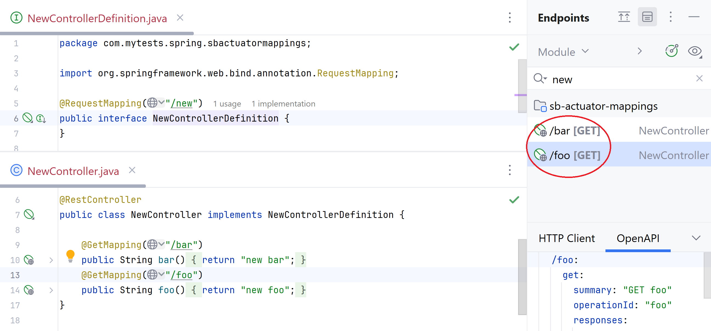

# Spring MVC:  type-level request mapping of controller base class is not considered
[IDEA-248534](https://youtrack.jetbrains.com/issue/IDEA-248534)

the HTTP Request is generated incorrectly also

#### See `com.mytests.spring.sbactuatormappings.parentInterfaceWithTopLevelMapping` package
#### See also `com.mytests.spring.sbactuatormappings.fewLevelsOfInheritanceWithTopLevelMappings` for multiple inheritance levels

## Same - for the inherited multiple class-level mappings:

 **expected**: 
  - 2 endpoints (`/topone/test1` and `/toptwo/test1`) are shown in Endpoints,
  - 2 http requests are generated
  - 2 paths in OpenApi draft
  - 
 **actual**: 
  - just `/test1` everywhere, both prefixes are ignored everywhere

#### See `com.mytests.spring.sbactuatormappings.parentInterfaceWithTopLevelMapping` package
 
# Multiple top-level mappings: OpenAPI draft is generated incorrectly

HTTP Request is generated correctly, and Endpoints view displays the correct paths, but
the OpenAPI draft includes the first top-level mapping only

[IDEA-338669](https://youtrack.jetbrains.com/issue/IDEA-338669)

# Mapping method implementations: OpenAPI draft can't be generated if the parent that defines method is not annotated as @Controller

[IDEA-319213](https://youtrack.jetbrains.com/issue/IDEA-319213)